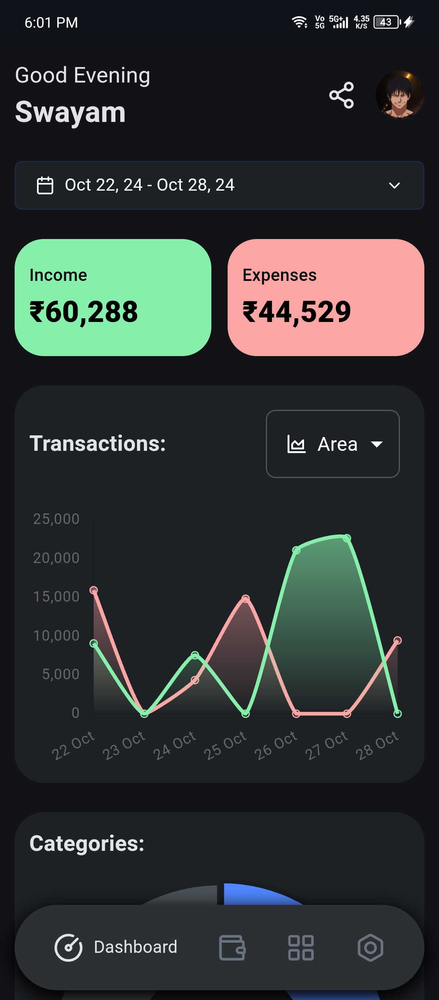
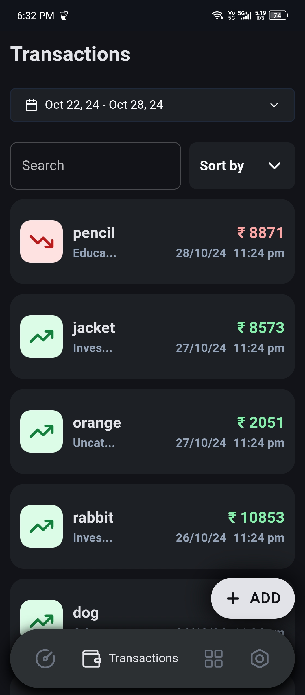
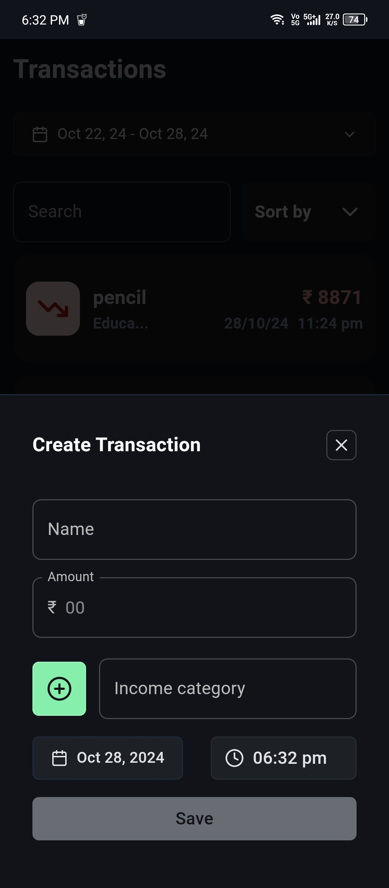
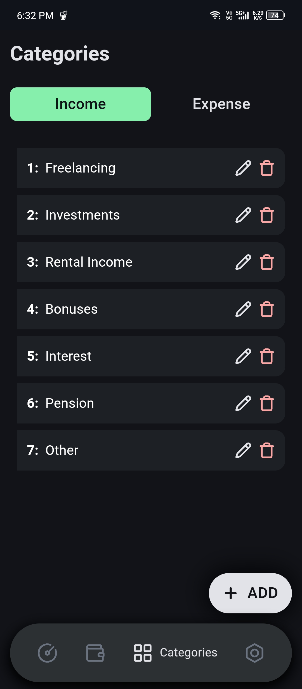
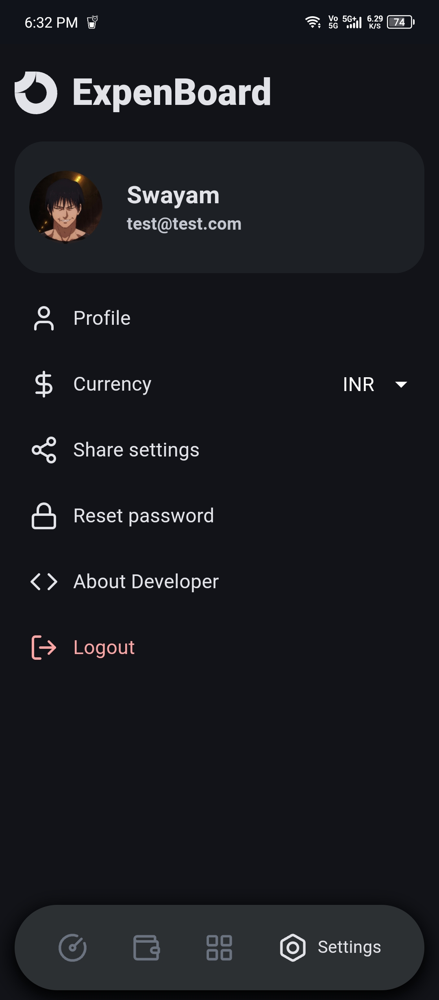
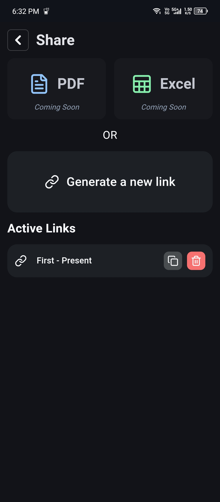

<a href="https://github.com/swymbnsl/expenBoard/">
<p align="center">
    
  </a>
<br/>
  <h3 align="center">ExpenBoard</h3>

<div align="center" >


[](https://github.com/prettier/prettier)


  </div>
  <p align="center">
    <br/>
    <a href="https://expenboard.vercel.app/">View Demo</a>
    .
    <a href="https://github.com/swymbnsl/expenboard/issues">Report Bug</a>
    .
    <a href="https://github.com/swymbnsl/expenboard/issues">Request Feature</a>
  </p>
</p>

## Table Of Contents

- [Table Of Contents](#table-of-contents)
- [About The Project](#about-the-project)
- [Built With](#built-with)
- [Getting Started](#getting-started)
  - [Prerequisites](#prerequisites)
  - [Installation](#installation)
  - [Local](#local)
- [Host your own](#host-your-own)
- [Contributing](#contributing)
  - [Creating A Pull Request](#creating-a-pull-request)
- [Raising an issue](#raising-an-issue)
- [Present and Future](#present-and-future)
- [ScreenShots](#screenshots)
  - [Visit ExpenBoard](#visit-expenboard)
- [Authors](#authors)

## About The Project


<br/>

ExpenBoard is an intuitive expense tracking application designed to simplify personal financial management by allowing users to seamlessly record, monitor, and analyze their spending. Built with Next.js, ExpenBoard offers a dynamic and responsive user experience, perfect for managing your budget, reviewing spending trends, and generating transaction reports. It’s especially crafted to make budgeting and financial planning easier through clean, organized data representation.

## Built With

ExpenBoard is built using NextJs

- [NextJS](https://nextjs.org)
- [TailwindCss](https://tailwindcss.com/)
- [Shadcn](https://ui.shadcn.com/)
- [Material UI](https://mui.com/material-ui/getting-started/)
- [Mongo DB](https://www.mongodb.com/)
- [BunJS](https://bun.sh/)

## Getting Started

### Prerequisites

<a href="https://git-scm.com/downloads" >Git</a> is a distributed version control system used for software development. It allows multiple developers to work on the same codebase simultaneously, keeping track of changes and managing versions. It also enables users to revert changes and collaborate more effectively.

<a href="https://bun.sh/">BunJS</a> is a JavaScript runtime, package manager, test runner and bundler built from scratch using the Zig programming language. It was designed by Jarred Sumner as a drop-in replacement for Node.js. Bun uses WebKit's JavaScriptCore as the JavaScript engine, unlike Node.js and Deno, which both use V8.

### Installation

### Local

`Rename .env.example to .env.local and fill the required fields`

```bash
git clone https://github.com/swymbnsl/ExpenBoard.git
```

```
cd ExpenBoard
```

```
bun install
```

```
bun dev
```

Server will start at http://localhost:3000/

## Host your own

- ## Vercel

[](https://vercel.com/new/clone?repository-url=https%3A%2F%2Fgithub.com%2Fswymbnsl%2FExpenBoard)
<br/>
<br/>

- ## Netlify

[](https://app.netlify.com/start/deploy?repository=https://github.com/swymbnsl/expenboard)
<br/>
<br/>

- ## Render

[](https://render.com/deploy?repo=https://github.com/swymbnsl/expenboard)

## Contributing

Contributions are what make the open source community such an amazing place to be learn, inspire, and create. Any contributions you make are **greatly appreciated**.

- If you have suggestions for adding or removing projects, feel free to [open an issue](https://github.com/swymbnsl/expenboard/issues) to discuss it

- Please make sure you check your spelling and grammar.

### Creating A Pull Request

Wanna contribute to ExpenBoard ?

1. Fork the Project
2. Create your Feature Branch (`git checkout -b feature/FeatureName`)
3. Commit your Changes (`git commit -m 'Add some FeatureName'`)
4. Push to the Branch (`git push origin feature/FeatureName`)
5. Open a Pull Request

## Raising an issue

We kindly ask that you provide as much detail as possible when submitting an issue, including steps to reproduce the problem, any error messages that you have seen, and any other relevant information. This will help us to identify and fix the issue more quickly.

Thank you for your cooperation, and we look forward to hearing from you!

## Present and Future

The website is still under development and supports only mobile devices for now. There are some bugs yet to be fixed and features that will be implemented soon

Refer to <a href="https://github.com/swymbnsl/ExpenBoard/blob/main/future-todos.md" >future-todos.md</a> for more details

## ScreenShots

### Dashboard


### Transactions Page



### Create Transactions



### Categories



### Settings



### Share



#### Visit <a href = "https://expenboard.vercel.app" target="_blank">ExpenBoard</a>

## Authors

- **Swayam Bansal** - [Swayam Bansal](https://github.com/swymbnsl) - _ExpenBoard_
